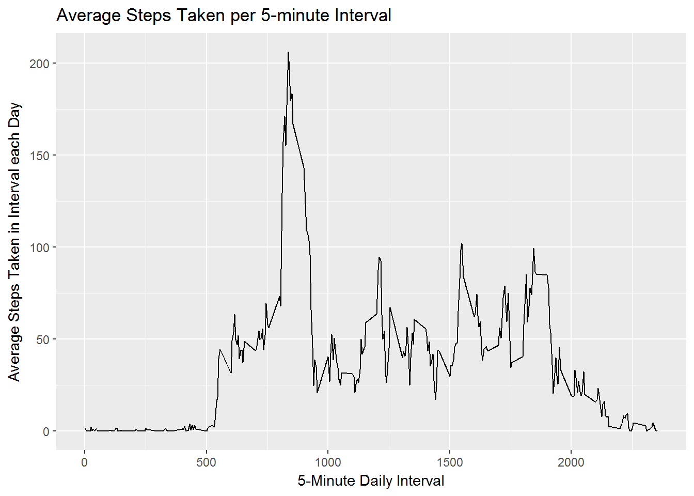
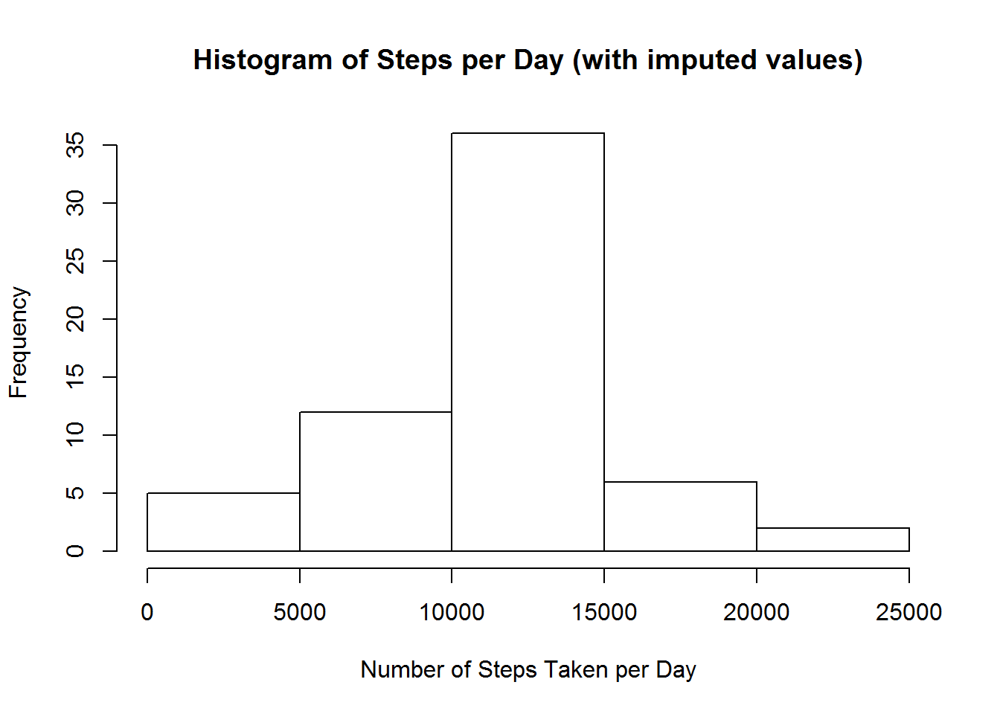
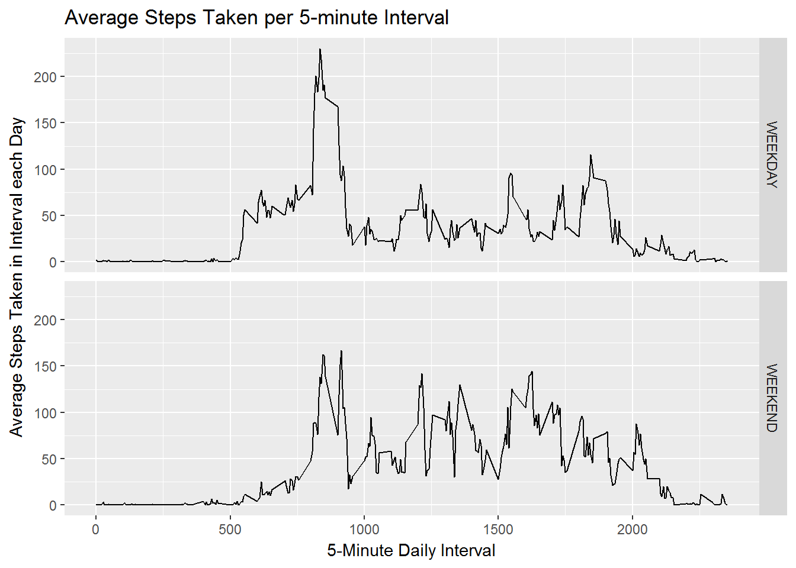

## Loading and Processing data

The code below loads and processes the data, sets up the working directory  
and loads all relevant libraries


```r
#sets working directory and removes unnecessary objects
setwd("C:/Users/jdeel/Documents/Training/JHU - Coursera/Reproducible Research/Week 2 Assignment")
rm(list = ls())

library(ggplot2)
```

```
## Warning: package 'ggplot2' was built under R version 3.4.4
```

```r
library(dplyr)
```

```
## 
## Attaching package: 'dplyr'
```

```
## The following objects are masked from 'package:stats':
## 
##     filter, lag
```

```
## The following objects are masked from 'package:base':
## 
##     intersect, setdiff, setequal, union
```

```r
#loads and processes data
stepdata <- read.csv("activity.csv")

stepdata$date <- as.Date(as.character(stepdata$date), format = "%Y-%m-%d")
```

## Section 1: Total Steps Per Day

The below code calculates the number of steps taken per day


```r
dates <- unique(stepdata$date)
steps <- numeric(length = 61)
stepsperday <- data.frame(dates,steps)

for (dat in dates) {
  stepsperday[dates==dat,2] <- with(subset(stepdata,date==dat),
                                    sum(steps, na.rm = TRUE))
}
```

The below code generates a histogram and reports the mean and median  
number of steps taken per day


```r
#generates histogram
hist(stepsperday$steps,
     main = "Histogram of Steps per Day",
     xlab = "Number of Steps Taken per Day")
```

<!-- -->

```r
#reports mean and median of steps taken per day
print(paste("Mean Steps per Day = ",mean(stepsperday$steps),sep = ""))
```

```
## [1] "Mean Steps per Day = 9354.22950819672"
```

```r
print(paste("Median Steps per Day = ",median(stepsperday$steps),sep = ""))
```

```
## [1] "Median Steps per Day = 10395"
```

## Section 2: What is the daily activity pattern?

The below code calculates the average steps taken per interval


```r
interval <- unique(stepdata$interval)
avgsteps <- numeric(length = 288)
stepsperint <- data.frame(interval,avgsteps)

for (int in interval) {
  stepsperint[interval==int,2] <- with(subset(stepdata,interval==int),
                                       mean(steps, na.rm = TRUE))
}
```

The below code creates a line plot and reports the interval with the highest  
number of average steps taken per day


```r
# creates line plot
plot <- ggplot(data = stepsperint, aes(x=interval,y=avgsteps))
plot <- plot + geom_line(aes(x=interval,y=avgsteps))
plot <- plot + labs(title = "Average Steps Taken per 5-minute Interval")
plot <- plot + xlab("5-Minute Daily Interval")
plot <- plot + ylab("Average Steps Taken in Interval each Day")
plot
```

<!-- -->

```r
#reports interval with max avg steps taken per day
maxsteps = max(stepsperint$avgsteps)
print(paste("Interval with Most Avg. Steps per Day = ",
            with(subset(stepsperint,avgsteps==maxsteps),print(interval)),
            sep = ""))
```

```
## [1] 835
## [1] "Interval with Most Avg. Steps per Day = 835"
```

## Section 3: Imputing Missing Values

The below code calculates and reports the number of rows in the original  
data with missing values


```r
print(paste("Total Number of Rows with Missing Step Data = ",
            sum(is.na(stepdata$steps)),
            sep = ""))
```

```
## [1] "Total Number of Rows with Missing Step Data = 2304"
```

The below code imputes missing values using the overall mean for the  
corresponding 5-minute interval that is missing


```r
impstepdata <- stepdata
impstepdata$dateinterval <- paste(as.character(impstepdata$date),
                                  as.character(impstepdata$interval))
for (datint in impstepdata$dateinterval) {
  if (is.na(impstepdata[impstepdata$dateinterval==datint,1])) {
    impstepdata[impstepdata$dateinterval==datint,1] <- with(subset(stepsperint,
                                                                   interval==impstepdata[impstepdata$dateinterval==datint,3]),
                                                            avgsteps)
  }
}
```

The below code repeats calculations for total number of steps taken per day  
with the new, imputed dataset


```r
#calculates steps per day
impstepsperday <- data.frame(dates,steps)

for (dat in dates) {
  impstepsperday[dates==dat,2] <- with(subset(impstepdata,date==dat),
                                    sum(steps, na.rm = TRUE))
}

#generates histogram
hist(impstepsperday$steps,
     main = "Histogram of Steps per Day (with imputed values)",
     xlab = "Number of Steps Taken per Day")
```

<!-- -->

```r
#reports mean and median of steps taken per day
print(paste("Mean Steps per Day (with imputed values) = ",
            mean(impstepsperday$steps),sep = ""))
```

```
## [1] "Mean Steps per Day (with imputed values) = 10766.1886792453"
```

```r
print(paste("Median Steps per Day (with imputed values) = ",
            median(impstepsperday$steps),sep = ""))
```

```
## [1] "Median Steps per Day (with imputed values) = 10766.1886792453"
```


## Section 4: Weekends

The below code creates a new factor variable in the imputed dataset  
designating weekend days from weekdays


```r
impstepdata$weekday <- weekdays(impstepdata$date)
impstepdata$weekend <- factor(character(length=17568))

impstepdata$weekend <- "WEEKDAY"
impstepdata$weekend[which(impstepdata$weekday == "Saturday")] <- "WEEKEND"
impstepdata$weekend[which(impstepdata$weekday == "Sunday")] <- "WEEKEND"

impstepdata$weekend <- as.factor(impstepdata$weekend)
```

The below code creates a panel line plot comparing average steps taken  
in each 5-minute interval on weekends and weekdays


```r
#calculates steps per interval, weekdays vs. weekends
wdstepsperint <- data.frame(interval,avgsteps)
wdstepsperint <- mutate(wdstepsperint,weekend="WEEKDAY")

for (int in interval) {
  wdstepsperint[interval==int,2] <- with(subset(impstepdata,interval==int &
                                                            weekend=="WEEKDAY"),
                                       mean(steps, na.rm = TRUE))
}

westepsperint <- data.frame(interval,avgsteps)
westepsperint <- mutate(westepsperint,weekend="WEEKEND")

for (int in interval) {
  westepsperint[interval==int,2] <- with(subset(impstepdata,interval==int &
                                                  weekend=="WEEKEND"),
                                         mean(steps, na.rm = TRUE))
}

wesstepsperint <- full_join(wdstepsperint,westepsperint)
```

```
## Joining, by = c("interval", "avgsteps", "weekend")
```

```r
#creates panel plot
plot <- ggplot(data = wesstepsperint, aes(x=interval,y=avgsteps))
plot <- plot + geom_line(aes(x=interval,y=avgsteps))
plot <- plot + facet_grid(as.factor(weekend) ~ .)
plot <- plot + labs(title = "Average Steps Taken per 5-minute Interval")
plot <- plot + xlab("5-Minute Daily Interval")
plot <- plot + ylab("Average Steps Taken in Interval each Day")
plot
```

<!-- -->

